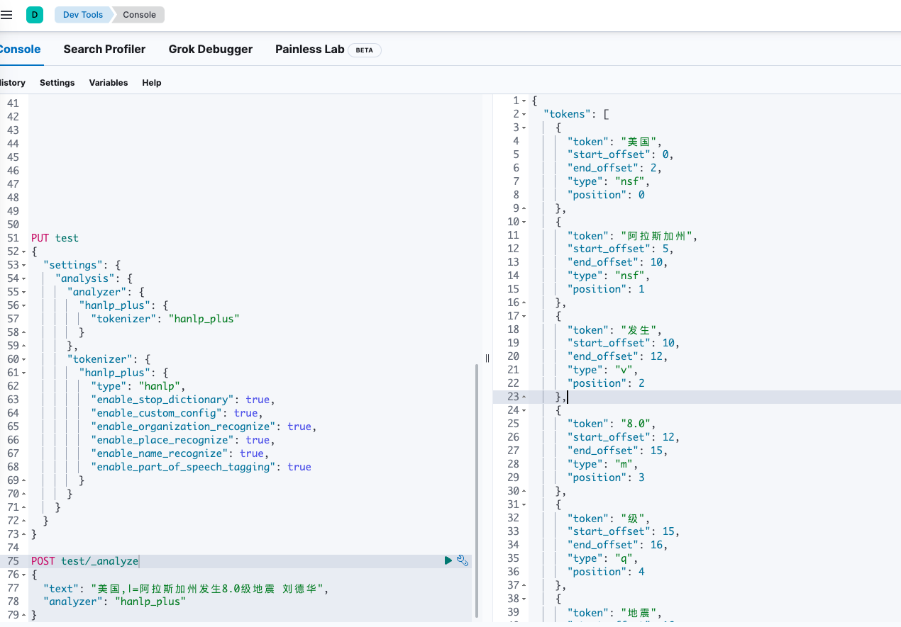

# [Elasticsearch HanLP分词器](https://github.com/lucky-xin/elasticsearch-analysis-hanlp.git)，ik分词器，pinyin分词器学习

## 1. 构建镜像
--------
运行```build_image.sh```脚本构建镜像
--------

## 2.启动es，运行命令

```shell
docker-compose up -d
```

## 3. 测试分词器
--------------------

### 1. HanLP分词器测试

### 1.1 使用hanLP自带分词器

```json lines
POST _analyze
{
    "text": "美国阿拉斯加州发生8.0级地震",
    "tokenizer": "hanlp"
}
```

结果如图：


### 1.2 自定义分词器

配置自定义分词器

```json lines
PUT test
{
  "settings": {
    "analysis": {
      "analyzer": {
        "hanlp_ner": {
          "tokenizer": "hanlp_ner"
        }
      },
      "tokenizer": {
        "hanlp_ner": {
          "type": "hanlp",
          "enable_stop_dictionary": true,
          "enable_custom_config": true,
          
          "enable_organization_recognize": true,
          "enable_place_recognize": true,
          "enable_name_recognize": true,
          "enable_part_of_speech_tagging": true
        }
      }
    }
  }
}
```

使用自定义分词器

```json lines
POST test/_analyze
{
  "text": "美国,|=阿拉斯加州发生8.0级地震 刘德华",
  "analyzer": "hanlp_ner"
}
```

结果如下图，其中type为[HanLP词性](https://www.hankcs.com/nlp/part-of-speech-tagging.html)


--------------------

## 4. NER词频统计
--------------------

### 1. 要实现倒排索引只保留指定词性数据，需要结合[Elasticsearch painless脚本](https://www.elastic.co/guide/en/elasticsearch/painless/current/painless-guide.html)和[predicate token filter](https://www.elastic.co/guide/en/elasticsearch/reference/current/analysis-predicatefilter-tokenfilter.html#analysis-predicatefilter-tokenfilter)

### 2. 索引配置
因为名词词性type都以n字母开头，所以使用```token.type.indexOf("n") == 0```来过滤倒排索引，请对照[HanLP词性](https://www.hankcs.com/nlp/part-of-speech-tagging.html)来配置

分词器配置
HanLP在提供了各类分词方式的基础上，也提供了一系列的分词配置，分词插件也提供了相关的分词配置，我们可以在通过如下配置来自定义自己的分词器：

| Config                             | Elastic version |
|:-----------------------------------|:----------------|
| enable_custom_config               | 是否开启自定义配置       |
| enable_index_mode                  | 是否是索引分词         |
| enable_number_quantifier_recognize | 是否识别数字和量词       |
| enable_custom_dictionary           | 是否加载用户词典        |
| enable_translated_name_recognize   | 是否识别音译人名        |
| enable_japanese_name_recognize     | 是否识别日本人名        |
| enable_organization_recognize      | 是否识别机构          |
| enable_place_recognize             | 是否识别地名          |
| enable_name_recognize              | 是否识别中国人名        | 
| enable_traditional_chinese_mode    | 是否开启繁体中文        |
| enable_stop_dictionary             | 是否启用停用词         |
| enable_part_of_speech_tagging      | 是否开启词性标注        |
| enable_remote_dict                 | 是否开启远程词典        |
| enable_normalization               | 是否执行字符正规化       |
| enable_offset                      | 是否计算偏移量         |

注意： 如果要采用如上配置配置自定义分词，需要设置enable_custom_config为true

```json lines
PUT /hanlp-ner
{
  "settings": {
    "analysis": {
      "analyzer": {
        "hanlp_ner": {
          "tokenizer": "hanlp_ner",
          "filter": [
            "hanlp_ner_filter"
          ]
        }
      },
      "tokenizer": {
        "hanlp_ner": {
          "type": "hanlp",
          "enable_stop_dictionary": true,
          "enable_custom_config": true,
          "enable_organization_recognize": true,
          "enable_translated_name_recognize": true,
          "enable_japanese_name_recognize": true,
          "enable_place_recognize": true,
          "enable_name_recognize": true,
          "enable_part_of_speech_tagging": true
        }
      },
      "filter": {
        "hanlp_ner_filter": {
          "type": "predicate_token_filter",
          "script": {
            "source": """
            token.type.indexOf("n") == 0
            """
          }
        }
      }
    }
  },
  "mappings": {
    "properties": {
      "title": {
        "type": "text",
        "analyzer": "hanlp_ner",
        "term_vector": "with_positions_offsets_payloads",
        "fielddata": "true",
        "fields": {
          "ik_word": {
            "type": "text",
            "analyzer": "ik_smart"
          }
        }
      },
      "content": {
        "type": "text",
        "analyzer": "hanlp_ner",
        "term_vector": "with_positions_offsets_payloads",
        "fielddata": "true",
        "fields": {
          "ik_word": {
            "type": "text",
            "analyzer": "ik_smart"
          }
        }
      }
    }
  }
}
```
### 3. 新增测试数据到索引hanlp-ner
```json lines
POST hanlp-ner/_doc
{
  "title": "白俄罗斯国防部：白俄罗斯直升机没有侵犯波兰领空",
  "content": "白俄罗斯国防部8月1日晚间发表声明表示，波兰军方和政府领导层有关白俄罗斯空军和防空部队的米-24和米-8直升机侵犯波兰边境的指控是凭空臆造，目的是再一次让波兰在白俄罗斯边界附近集结部队和装备合理化。白俄罗斯国防部强调， 当天上午波兰武装力量作战指挥部安抚民众， 称波兰雷达没有发现侵犯波兰边界的行为， 到了晚上却宣称“ 越境发生在非常低的高度， 阻碍了雷达系统的探测”。白俄罗斯国防部认为， 未经客观监控系统数据证实的波兰方面的声明纯粹是“ 小道消息”， 并强调白俄罗斯的米 - 24 和米 - 8 直升机没有侵犯波兰领空。（ 总台记者 宋瑶） "
}

POST /hanlp-ner/_doc
{
  "title": "司法改革将以色列拖入严重危机，以总理发声：保证不会升级成内战",
  "content": "【环球网报道 记者 张晓雅】俄罗斯卫星通讯社报道称，以色列总理内塔尼亚胡8月1日表示，他不认为因司法改革引发的持续社会危机会像以色列总统担心的那样升级为“内战”。\n\n　　报道称，内塔尼亚胡今日接受媒体采访时表示，“我向你们保证，不会发生内战。”“我认为，人们被煽动起来的恐惧会消退，他们会看到以色列和以前一样民主，甚至更加民主。”\n\n　　内塔尼亚胡还表示，以色列政府提出的司法改革旨在纠正“以色列民主的不平衡，司法机构僭取了行政部门和立法机构的所有权力”。\n\n　　围绕司法改革的争议已将以色列拖入一场严重的政治危机。以色列总统伊萨克 赫尔佐格今年3月表示，这场危机如果得不到解决，可能会引发“真正的内战”。7月29日，以色列再次出现抗议司法改革的大规模示威。这是以政府1月宣布司法改革方案后，抗议者连续第30周在周末举行示威游行。有媒体评论称，这场撕裂以色列的史上最大危机其实是该国的国家身份危机，是“国家灵魂之战”。《卫报》称，即使没有内战，以色列也可能迎来“黑暗的未来”。有评论认为，没有人知道以色列“断层线”上的哪个板块会获胜，哪个板块会崩溃，以色列正在进入未知领域。"
}
```
### 4. 词频统计
### 4.1 基于index统计content字段词频（名词在多少篇文章提及）
```json lines
POST hanlp-ner/_search
{
   "size" : 0,  
    "aggs" : {   
        "content" : {   
            "terms" : {   
              "size" : 100,
              "include" : "[^x00-xff]{2,}",
              "field" : "content"
            }  
        }
    }
}
```
查询结果
```json lines
{
  "took": 1127,
  "timed_out": false,
  "_shards": {
    "total": 1,
    "successful": 1,
    "skipped": 0,
    "failed": 0
  },
  "hits": {
    "total": {
      "value": 2,
      "relation": "eq"
    },
    "max_score": null,
    "hits": []
  },
  "aggregations": {
    "content": {
      "doc_count_error_upper_bound": 0,
      "sum_other_doc_count": 0,
      "buckets": [
        {
          "key": "记者",
          "doc_count": 2
        },
        {
          "key": "以政府",
          "doc_count": 1
        },
        {
          "key": "以色列",
          "doc_count": 1
        },
        {
          "key": "以色列政府",
          "doc_count": 1
        },
        {
          "key": "伊萨克",
          "doc_count": 1
        },
        {
          "key": "作战指挥部",
          "doc_count": 1
        },
        {
          "key": "俄罗斯卫星通讯社",
          "doc_count": 1
        },
        {
          "key": "内塔尼亚胡",
          "doc_count": 1
        },
        {
          "key": "内战",
          "doc_count": 1
        },
        {
          "key": "军方",
          "doc_count": 1
        },
        {
          "key": "凭空臆造",
          "doc_count": 1
        },
        {
          "key": "卫报",
          "doc_count": 1
        },
        {
          "key": "危机",
          "doc_count": 1
        },
        {
          "key": "可能会",
          "doc_count": 1
        },
        {
          "key": "司法",
          "doc_count": 1
        },
        {
          "key": "司法机构",
          "doc_count": 1
        },
        {
          "key": "国家",
          "doc_count": 1
        },
        {
          "key": "国防部",
          "doc_count": 1
        },
        {
          "key": "声明",
          "doc_count": 1
        },
        {
          "key": "媒体",
          "doc_count": 1
        },
        {
          "key": "宋瑶",
          "doc_count": 1
        },
        {
          "key": "小道消息",
          "doc_count": 1
        },
        {
          "key": "张晓雅",
          "doc_count": 1
        },
        {
          "key": "总台",
          "doc_count": 1
        },
        {
          "key": "总理",
          "doc_count": 1
        },
        {
          "key": "总统",
          "doc_count": 1
        },
        {
          "key": "抗议者",
          "doc_count": 1
        },
        {
          "key": "拖入",
          "doc_count": 1
        },
        {
          "key": "改革方案",
          "doc_count": 1
        },
        {
          "key": "政府",
          "doc_count": 1
        },
        {
          "key": "政治危机",
          "doc_count": 1
        },
        {
          "key": "数据",
          "doc_count": 1
        },
        {
          "key": "断层",
          "doc_count": 1
        },
        {
          "key": "方面",
          "doc_count": 1
        },
        {
          "key": "未知领域",
          "doc_count": 1
        },
        {
          "key": "权力",
          "doc_count": 1
        },
        {
          "key": "板块",
          "doc_count": 1
        },
        {
          "key": "武装力量",
          "doc_count": 1
        },
        {
          "key": "民众",
          "doc_count": 1
        },
        {
          "key": "没有人",
          "doc_count": 1
        },
        {
          "key": "波兰",
          "doc_count": 1
        },
        {
          "key": "灵魂",
          "doc_count": 1
        },
        {
          "key": "环球网",
          "doc_count": 1
        },
        {
          "key": "白俄罗斯",
          "doc_count": 1
        },
        {
          "key": "目的",
          "doc_count": 1
        },
        {
          "key": "直升机",
          "doc_count": 1
        },
        {
          "key": "示威游行",
          "doc_count": 1
        },
        {
          "key": "社会",
          "doc_count": 1
        },
        {
          "key": "空军",
          "doc_count": 1
        },
        {
          "key": "立法机构",
          "doc_count": 1
        },
        {
          "key": "系统",
          "doc_count": 1
        },
        {
          "key": "行为",
          "doc_count": 1
        },
        {
          "key": "行政部门",
          "doc_count": 1
        },
        {
          "key": "装备",
          "doc_count": 1
        },
        {
          "key": "评论",
          "doc_count": 1
        },
        {
          "key": "赫尔佐格",
          "doc_count": 1
        },
        {
          "key": "身份",
          "doc_count": 1
        },
        {
          "key": "边界",
          "doc_count": 1
        },
        {
          "key": "部队",
          "doc_count": 1
        },
        {
          "key": "防空部队",
          "doc_count": 1
        },
        {
          "key": "雷达",
          "doc_count": 1
        },
        {
          "key": "领导层",
          "doc_count": 1
        },
        {
          "key": "领空",
          "doc_count": 1
        }
      ]
    }
  }
}
```

### 4.2 词频统计，[词频统计查询API](https://www.elastic.co/guide/en/elasticsearch/reference/current/docs-multi-termvectors.html)
```json lines
POST hanlp-ner/_mtermvectors
{
  "docs": [
    {
      "_id": "Exi1tIkBiY6V5XBx5wYL",
      "field_statistics": true,
      "term_statistics": true,
      "fields": [
        "content"
      ]
    }
  ]
}
```


--------------------